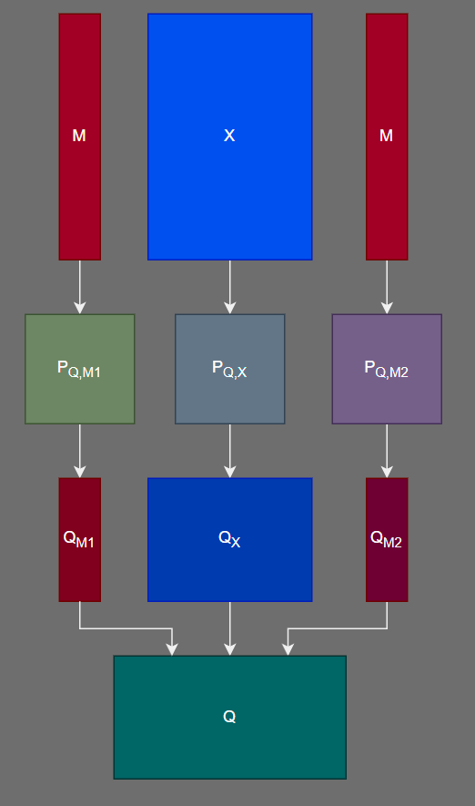
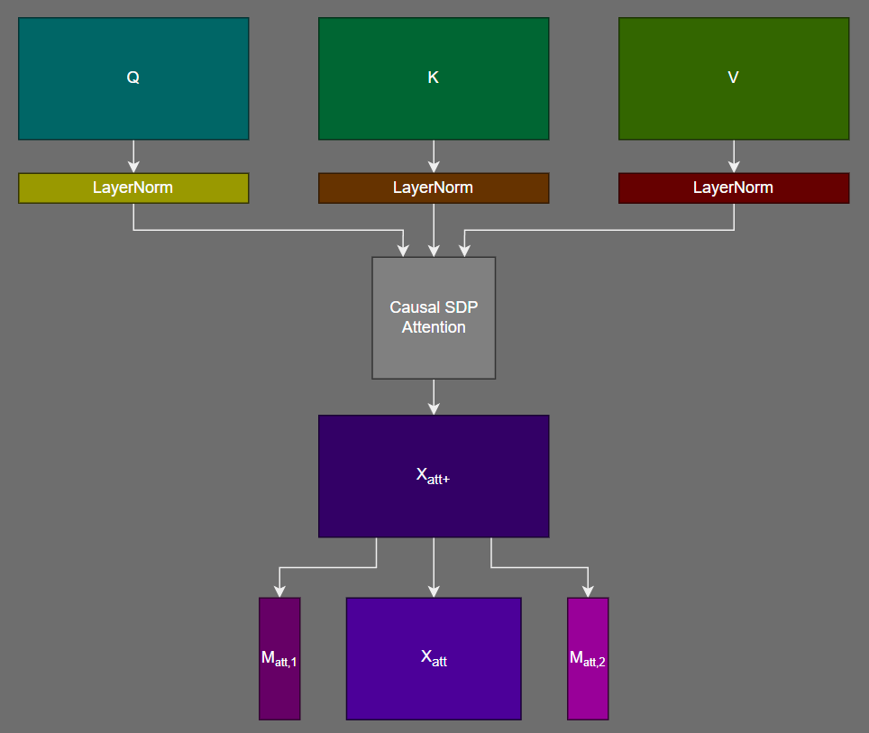
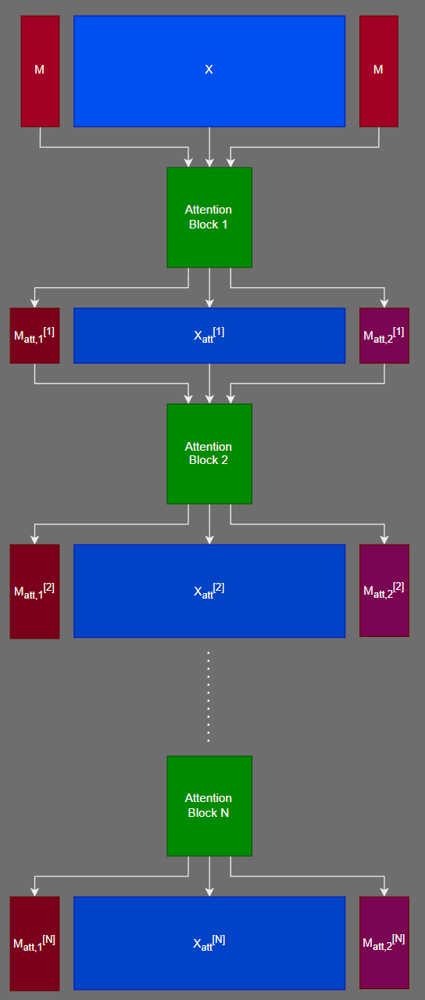
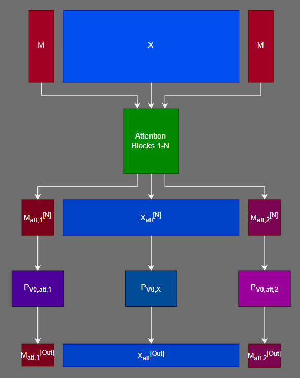
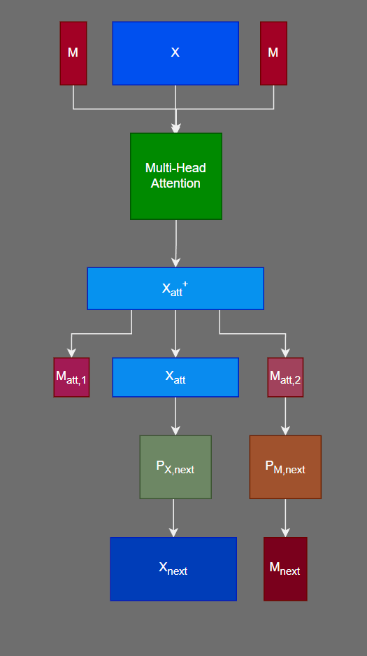

# Om LLM


- [Om LLM](#om-llm)
  - [Overview](#overview)
    - [Features](#features)
    - [Novel Contributions (at time of writing) and Publication](#novel-contributions-at-time-of-writing-and-publication)
    - [Architecture Details](#architecture-details)
      - [Attentive Recent Cell (ARC)](#attentive-recent-cell-arc)
      - [Initial Convolutional Layers](#initial-convolutional-layers)
      - [A Note on the Final MLP](#a-note-on-the-final-mlp)
  - [`ARC`: Attentive Recurrent Cell](#arc-attentive-recurrent-cell)
    - [`ARC` Usage](#arc-usage)
  - [`ARCformer`: Attentive Recurrent Cell (ARC) Transformer](#arcformer-attentive-recurrent-cell-arc-transformer)
    - [`ARCformer` Usage](#arcformer-usage)
  - [`RoPEEmbeddings`](#ropeembeddings)
    - [`RoPEEmbeddings` Usage](#ropeembeddings-usage)
  - [`OmLLM`](#omllm)
    - [`OmLLM` Usage](#omllm-usage)
  - [Installation](#installation)
  - [Requirements](#requirements)
  - [Future Work](#future-work)
  - [Contributing](#contributing)
  - [License](#license)

## Overview

Om LLM is a project that implements an advanced large language model (LLM) architecture using Attentive Recurrent Cells (ARC).

[Top](#om-llm)

### Features

- Arbitrary-length input sequences with bounded memory requirements
- Cache-able context
- Multi-pass memory transformer
- Ability to handle sequences of characters, or sequences of tokens
- Reduced dependence on tokenizer through use of initial convolutional layers

[Top](#om-llm)

### Novel Contributions (at time of writing) and Publication

- Use of "state token sequences" in conjunction with a recurrence mechanism which utilizes attention calculations to update state
  - This allows for effective arbitrary-length input sequences
- Multi-pass transformer memory
  - This allows for greater expressivity and noise-robustness in the memory portion of the transformer
- Initial convolutional layers
  - This allows for the model to:
    - Learn effectively, regardless of the choice of tokenizer
    - Potentially eliminate the need for a tokenizer

To the best of my knowledge, these features are novel. If you find any references to these features in the literature, please let me know. My email is [ryan@beta-reduce.net](ryan@beta-reduce.net)

I do not plan on publishing a paper on this project. If you would like to use this project in your own work, please cite this repository, and its creator (Ryan P. Taylor).

[Top](#om-llm)

### Architecture Details

#### Attentive Recent Cell (ARC)

The core of Om LLM is the `ARC` (Attentive Recurrent Cell). It represents a recurrent cell that utilizes attention calculations to update the state. The first operation of an `ARC` is a simple sequence of projections on the input sequence and state sequence. Note that there are two distinct projections performed on the state sequence. This is done to prepare the prepended copy of the state sequence for "reading" and the appended copy of the state sequence for "writing". The result of each such triple of projections is concatenated along the sequence dimension to form the query, key, and value tensors. This projection step is illustrated below for the query tensor:



One we've projected to form the query, key and value tensors, we apply LayerNorm. Although not shown in the figure below, it is at this point that positional embeddings (RoPE) may be added to the query and key tensors, and/or the attention matrix (CoPE). We then pass the three tensors through a standard scaled dot-product attention layer with a causal attention mask.

An important point is that each position in the non-memory sequence attends to the "read" state sequence, allowing the model to utilize the current state of the input sequence. Likewise, each position in the "write" state sequence attends to the entire non-memory sequence, as well as the "read" state sequence, allowing the model to update the current state using the attention mechanism.

The attention step is illustrated below:



In the following, we will refer to the operations performed thus far as an "attention block." One of the novel ideas expressed in Om LLM is the use of a sequence of attention blocks, rather than a single attention block.

Note that a single attention block represents an approximate nearest-neighbor lookup, and the result that's learned is a number of "prototype regions" within the value dimension and the effective number of "prototype regions" that can be expressed through the projection matrices. Instead, if we perform multiple such approximate nearest-neighbor lookups, the model can learn a distributed representation in the form of "paths" between "prototype regions." This more expressive form of memory comes at a limited additional computational cost and adds a negligible number of parameters to the model.

The mechanics of the multi-pass memory (with multiple attention blocks) are illustrated below:



If the final value dimension in the sequence differs from the first value dimension, the model performs a projection from the final value dimension to the first value dimension. This is done (with the assumption that the first value dimension is the smallest) to reduce the number of parameters needed when projecting from the output dimension of the memory operation back to the input dimension.

This allows us to use sequences of increasingly large memory dimensions, while only adding a small number of parameters to the model.

This projection is illustrated below:



We will now refer to all of the operations performed thus far as an "attention head." Just as in the case of an ordinary transformer, we will use multiple attention heads in parallel, and concatenate the results along the representation dimension. This is followed by another concatenation of the "read" state sequence, the non-memory sequence and the "write" state sequence. Note that this second concatenation is only performed to simplify the model code and is mathematically unnecessary.

The final result is referred to as an Attentive Recurrent Cell (ARC), and is illustrated below:



From here, the operations are similar to those of an ordinary transformer.

[Top](#om-llm)

#### Initial Convolutional Layers

The second layer of Om LLM is an (optional) series of 1-d convolutional layers that act on the initial embeddings. Each of these layers has a number of filters equal to the embedding dimension of the model. The result of the convolutions are added to the input sequence (after truncation). Because the truncation is necessary to maintain the embedding dimension, we must either re-use the past `k-1` inputs, or pre-pad our input with `k-1` pad tokens, where `k` is the largest kernel size used in the convolutions. The sum of the input, together with the result of the convolutions, is then passed through an `ARC`. Note that these convolutions are only performed for the first `ARCformer` layer in the model.

The rationale for the convolutions is to learn an adjustment to the specific tokens used by the tokenizer, as well as to potentially allow the model to learn directly from characters, using the convolutional layers as a kind of "learned tokenizer."

[Top](#om-llm)

#### A Note on the Final MLP

The final MLP has a parameter to multiply the dimensions of the final two dimensions in the MLP. If this is specified, the final residual connection is dropped. By utilizing this parameter, we can give a larger parameter budget to the final output decision, which has been hypothesized to be a bottleneck in smaller models.

[Top](#om-llm)

## `ARC`: Attentive Recurrent Cell

The Attentive Recurrent Cell (`ARC`) is a lower-level component of Om LLM. It represents a recurrent cell that utilizes attention calculations to update the state. Unlike the multi-head attention component of a transformer, the memory component of an `ARC` performs a sequence of project-then-attend operations. Beyond the first of these operations, the number of additional parameters added to the model is rather small, having nine matrices of size `(memory_dim_prev, memory_dim_next)` for each memory head: three for the "read" state sequence, three for the "write" state sequence, and three for the non-state sub-sequence. Additionally, `ARC` is compatible with RoPE and/or CoPE positional embeddings.

The forward pass of `ARC` requires three inputs:

- A `Tensor` sub-sequence of the input
- A current state token sequence `Tensor`, and
- An `int` offset, representing the location of the current sub-sequence in the input sequence.

It will produce two outputs `Tensor`s:

- The typical output sequence from a multi-head attention block, as well as
- A state token sequence, which is used to process the next input sub-sequence.

[Top](#om-llm)

### `ARC` Usage

The `ARC` class can be instantiated with the following parameters:

- `dim_input` (`int`): The dimension of the input sequence.
- `dims_key` (`List[int]`): The dimensions of the key/query vectors for each layer in the attention block.
- `dims_value` (`List[int]`): The dimensions of the value vectors for each layer in the attention block.
- `num_heads` (`int`): The number of heads in the attention block.
- `segment_len` (`int`): The length of the segment to be processed at a time.
- `state_len` (`int`): The length of the state token sequence.
- `attn_normalize` (`bool`): Whether to normalize the inputs to SDP attention.
- `dropout` (`float`): The dropout rate for the attention block.
- `attn_proj_rank` (`int`): The rank of the projection from final value dim to input dim.
- `num_layers` (`int`): The number of `ARCformer` layers in the parent `OmLLM` model (used for weight initialization).
- `layer_num` (`int`): Position of the current layer (used for diff attention lambda calculation and state token sequence initialization).
- `cope` (`bool`): Whether to use CoPE positional embeddings.
- `diff_attn` (`bool`): Whether to use diff attention.
- `position_embedders` (`List[Optional[RoPEEmbeddings]]`): A list of optional positional embedding objects for each layer in the attention block.

Once instantiated, an `ARC` object can be called as follows:

```python
output, state_token_sequence = arc(input_sequence, state_token_sequence, offset)
```

The `output` `Tensor` will have the same shape as the input sequence, and can be passed to the MLP portion of an `ARCformer`. The `state_token_sequence` `Tensor` will have the same shape as `state_token_sequence`, and can be passed as the `state=` argument for the next sub-sequence processed by this `ARC` layer.

[Top](#om-llm)

## `ARCformer`: Attentive Recurrent Cell (ARC) Transformer

The ARC Transformer (`ARCformer`) is a middle-level component of Om LLM. It represents a transformer-like architecture that incorporates multi-pass memory, as well as "state token sequence" recurrence. The forward pass of `ARCformer` requires three inputs:

- A `Tensor` sub-sequence of the input
- A current state token sequence `Tensor` (the initial state for each `ARCformer` is a learned parameter), and
- An `int` offset, representing the location of the current sub-sequence in the input sequence.

It will produce two outputs `Tensor`s:

- The usual output sequence from a transformer block, as well as
- A state token sequence, which is used to process the next input sub-sequence.

[Top](#om-llm)

### `ARCformer` Usage

The `ARCformer` class can be instantiated with the following parameters:

- `dim_input` (`int`): The dimension of the input sequence.
- `dim_hidden` (`int`): The dimension of the hidden layer for the MLP portion of the transformer.
- `dims_key` (`List[int]`): The dimensions of the key/query vectors for each layer in the attention block.
- `dims_value` (`List[int]`): The dimensions of the value vectors for each layer in the attention block.
- `num_heads` (`int`): The number of heads in the attention block.
- `activation` (`str`): The activation function to use for the MLP portion of the transformer. Must be one of:
  - "relu"
  - "gelu"
  - "swish"
  - "swiglu"
  - "geglu"
  - "ffnglu"
  - "ffngeglu"
  - "ffnswiglu"
  - "abs"
- `segment_len` (`int`): The length of the segment to be processed at a time.
- `state_len` (`int`): The length of the state token sequence.
- `attn_normalize` (`bool`): Whether to normalize the inputs to SDP attention.
- `num_layers` (`int`): The number of `ARCformer` layers in the parent `OmLLM` model (used for weight initialization).
- `layer_num` (`int`): Position of the current layer (used for diff attention lambda calculation and state token sequence initialization).
- `cope` (`bool`): Whether to use CoPE positional embeddings.
- `position_embedders` (`List[Optional[RoPEEmbeddings]]`): A list of optional positional embedding objects for each layer in the attention block.
- `dropout` (`float`): The dropout rate for the MLP portion of the transformer. (Default: 0.0)
- `attn_dropout` (`float`): The dropout rate for attention calculations. (Default: 0.0)
- `diff_attn` (`bool`): Whether to use diff attention.
- `attn_dropout` (`float`): The dropout rate for attention calculations. (Default: 0.0)
- `attn_proj_rank` (`int`): The rank of the projection from final value dim to input dim before MLP. (Default: -1 -- use smallest value dim)
- `mlp_multiplier` (`int`): Multiplier for the final two layers of the MLP portion of the transformer. (Default: 1)
- `mlp_1221` (`bool`): Whether to use the 1-2-2-1 MLP architecture. (Default: False)

Once instantiated, an `ARCformer` object can be called as follows:

```python
output, state_token_sequence_next = arcformer(input_sequence, state_token_sequence, offset)
```

The `output` `Tensor` will have the same shape as the input sequence (unless `mlp_multiplier` is not 1, in which case the final dimension in `output` dimension will be `mlp_multiplier` times the final dimension in the input), and can be passed to the next `ARCformer` in the model. The `state_token_sequence_next` `Tensor` will have the same shape as `state_token_sequence`, and can be passed as the `state=` argument for the next sub-sequence processed by this `ARCformer`.

[Top](#om-llm)

## `RoPEEmbeddings`

RoPEEmbeddings is a class that implements the RoPE (Rotary Position Embedding) positional embedding scheme, as described in the paper "RoFormer: Enhanced Transformer with Rotary Position Embedding" by Jianlin Su et al. ([arxiv](https://arxiv.org/abs/2104.09864)). It has minor modifications made to support `ARC`'s recurrent structure.

[Top](#om-llm)

### `RoPEEmbeddings` Usage

The `RoPEEmbeddings` class can be instantiated with the following parameters:

- `dim` (`int`): Key/Query dimension of the corresponding attention layer.
- `seq_len` (`int`): Maximum sequence length.
- `dim_embedding_pct` (`float`): Percentage of the total embedding dimension to use for the positional embeddings. Must be within the interval (0, 1]. Defaults to 0.5.
- `base` (`int`, optional): Base used for calculating thetas. Defaults to 10000.

Once instantiated, a `RoPEEmbeddings` object can be called as follows:

```python
q_rope = rope(q, offset)
k_rope = rope(k, offset)

att = sdp_attention(q_rope, k_rope, v)
```

Although users are unlikely to directly interface with a `RoPEEmbeddings` object, it's necessary to instantiate them when using RoPE in an `OmLLM` object.

[Top](#om-llm)

## `OmLLM`

The `OmLLM` class is the primary user-facing class in this package. It represents an LLM using the Om architecture, which utilizes `ARC` memory, as well as (optional) initial convolutional operations on the embeddings. Note that these embeddings can either come from tokens, or from direct characters.

The inputs to an `OmLLM` object are:

- A `Tensor` of token/character indices.
- A list of initial state token sequences (one for each `ARCformer` layer in the model). If an empty list is provided, the learned initial state token sequences will be used for each `ARCformer`. This argument is the means through which inference with a cached context is performed.
- An `int` offset for the input text (default: 0). This can be set to a nonzero value when performing inference with a cached context (where the value will be equal to the length of the cached context).
- A `bool` indicating whether or not to only produce predictions for the next token. If `False`, next-token predictions will be produced for the entire input.

The outputs of an `OmLLM` object are:

- A `Tensor` of logits for next tokens; this can either be a sequence of such logit vectors, or a single logit vector, depending on whether the user has specified to only predict the next token.
- A list of state token sequence `Tensor`s at the final input. This can be cached to perform context caching.
- An `int` offset for the input sequence. This can be used to perform context caching.

[Top](#om-llm)

### `OmLLM` Usage

The `OmLLM` class can be instantiated with the following parameters:

- `num_layers` (`int`): The number of `ARCformer` layers in the model.
- `vocab_size` (`int`): The size of the input vocabulary. If not divisible by 8, this will be internally padded to the next multiple of 8 (to make softmax computation during next-token prediction more efficient).
- `dim_input` (`int`): The dimension of the input sequence.
- `dim_hidden` (`int`): The dimension of the hidden layer for the MLP portion of the transformers.
- `dims_key` (`List[int]`): The dimensions of the key/query vectors for each layer in the attention blocks.
- `dims_value` (`List[int]`): The dimensions of the value vectors for each layer in the attention blocks.
- `num_heads` (`int`): The number of heads in the attention blocks.
- `activation` (`str`): The activation function to use for the MLP portion of the transformers. Must be one of:
  - "relu"
  - "gelu"
  - "swish"
  - "swiglu"
  - "geglu"
  - "ffnglu"
  - "ffngeglu"
  - "ffnswiglu"
  - "abs"
- `segment_len` (`int`): The length of the segment to be processed at a time.
- `state_len` (`int`): The length of the state token sequence.
- `attn_normalize` (`bool`): Whether to normalize the inputs to SDP attention.
- `cope` (`bool`): Whether to use CoPE positional embeddings.
- `position_embedders` (`List[Optional[RoPEEmbeddings]]`): A list of optional positional embedding objects for each layer in the attention blocks.
- `betas` (`List[Optional[float]]`): A list of betas for Hopfield attention.
- `dropout` (`float`): The dropout rate for the MLP portion of the transformers. (Default: 0.0)
- `diff_attn` (`bool`): Whether to use diff attention. (Default: False)
- `attn_dropout` (`float`): The dropout rate for the attention blocks. (Default: 0.0)
- `attn_proj_rank` (`int`): The rank of the projection from final value dim to input dim before MLP. (Default: -1 -- use smallest value dim)
- `init_convs` (`List[int]`): The kernel widths for initial convolutional layers. Leave empty to not use initial convolutional layers. (Default: [])
- `final_mlp_multiplier` (`int`): Multiplier for the final two layers of the MLP portion of the final transformer. (Default: 1)
- `mlp_1221` (`bool`): Whether to use the 1-2-2-1 MLP structure for the MLP portion of the transformers. (Default: False)

Once instantiated, an `OmLLM` object can be called as follows:

```python
output, state_token_sequence_end, offset = omllm(input_sequence, state_token_sequence, offset, next_token_flag)
```

The `output` `Tensor` will contain logits for each next-token prediction. If `next_token_flag` is `False` (the default) it will have dimensions `(batch_size, seq_len, vocab_size_adj)`, where `vocab_size_adj` is equal to the input vocab size plus an offset to make the number divisible by 8 (which is done to make downstream softmax computations more efficient on CUDA devices -- note, all "padded" logits are set to `-inf`); if `next_token_flag` is `True`, the `Tensor` will have dimensions `(batch_size, vocab_size_adj)` and represent only the logits for the final next-token in the input.

The `state_token_sequence_end` `Tensor` will have the same shape as `state_token_sequence`, and can be stored to be used as the initial state token sequence for the next call to the model (context caching).

The `offset` `int` will be the offset for the input sequence. This can be used to perform context caching.

[Top](#om-llm)

## Installation

To install Om LLM, run the following commands:

```bash
git clone https://github.com/dingo-actual/om.git
cd om
pip install -r requirements.txt
```

[Top](#om-llm)

## Requirements

- Python 3.10+
- PyTorch 2.0+
- xformers 0.0.26+
- NumPy 1.25+
- Datasets 2.19.1+
- Tiktoken 0.7.0+
- Orjson 3.10.3+
- Polars 0.20.29+
- Zstandard 0.22.0+
- Accelerate 0.20.1+
- ScheduleFree 1.2.5+
- TorchMetrics 1.4.0+

[Top](#om-llm)

## Future Work

- Investigate the properties of the `ARCformer` initial state token sequence after training.
  - Hopefully, this allows for the initial state token sequence to be initialized in a static fashion, rather than being learned (which may make training more difficult).
- Investigate the impact of the state token sequence length on the length generalization of the model.

[Top](#om-llm)

## Contributing

We welcome contributions to Om LLM. Please see our [Contributing Guidelines](CONTRIBUTING.md) for more information.

[Top](#om-llm)

## License

Om LLM is released under the [Apache 2.0 License](LICENSE).

[Top](#om-llm)
